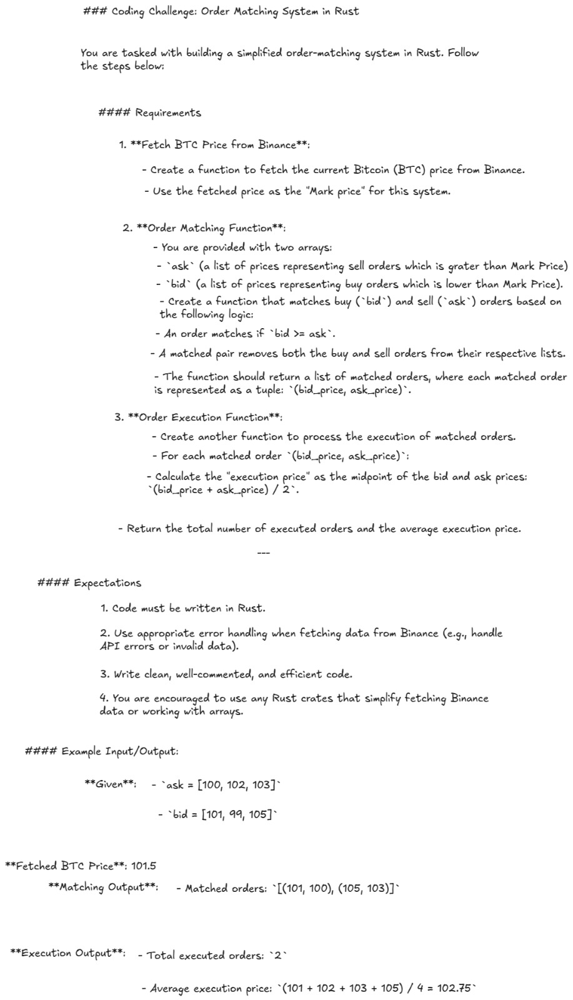

# FxDx – Rust Developer – 2 Years Experience

## Overview

* **Company**: FxDx
* **Role**: Rust Developer
* **Location**: Bengaluru, Karnataka, India, In Office
* **Interview Date**: Dec, 2024
* **Experience Level**: 2 years in Rust
* **Application Source**: LinkedIn

## Interview Process

1. **Round 1 – Technical Interview**

   * **Duration**: 60 minutes
   * **Format**: Discussion
   * **Questions Asked**:

     * Questions were asked based on my resume and experience.
     * Explain Ownership, Borrowing, and Lifetimes in detail and other Rust basics like String and &str and more.
     * Discussed on the Rust projects I had worked on.
     * Questions on async Rust, Tokio, etc.
   * **Discussion Points**: Ownership & Borrowing, basic programs, project discussion.

2. **Round 2 – Technical Interview**

   * **Duration**: 60 minutes
   * **Format**: Live Coding
   * **Questions Asked**:

     * A Leetcode easy problem was asked: [Best Time to Buy and Sell Stock](https://leetcode.com/problems/best-time-to-buy-and-sell-stock/description/)
     * I was asked to implement this machine coding task live during the interview:
       
   * **Discussion Points**: DSA, discussion around the task.

## Key Rust Topics Covered

* Ownership and Borrowing
* Backend basics
* DSA and Machine Coding in Rust

## Outcome

* **Result**: Ghosted
* **Feedback Received**: No
* **Personal Reflections**: I was able to finish the task. After repeated follow-ups, I have not received any response from HR.

## Tips for Future Candidates

* Focus on core Rust concepts and practice explaining them clearly with examples.
* Practice implementation of machine coding challenges in Rust.
* Focus on solving DSA problems in Rust.